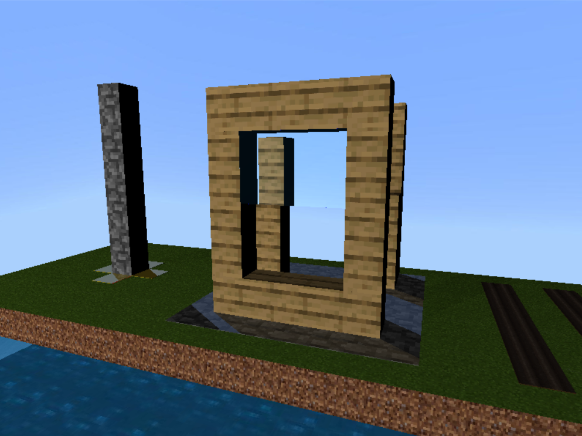
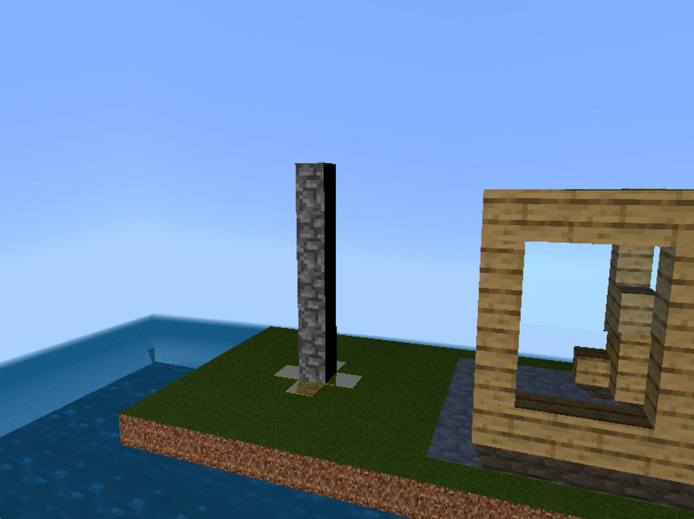
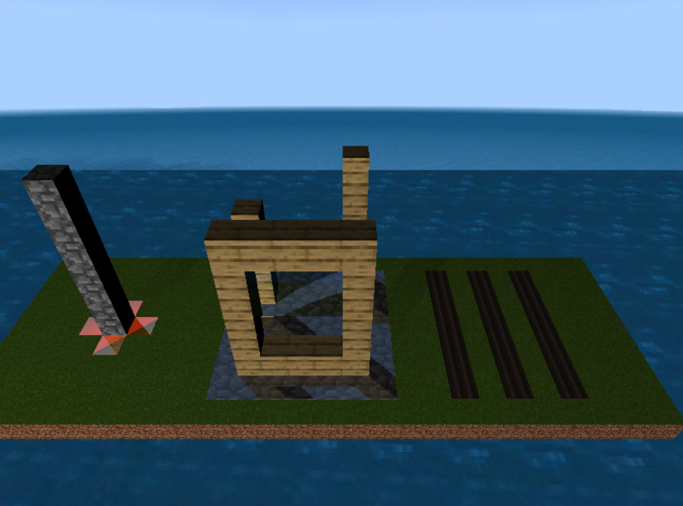
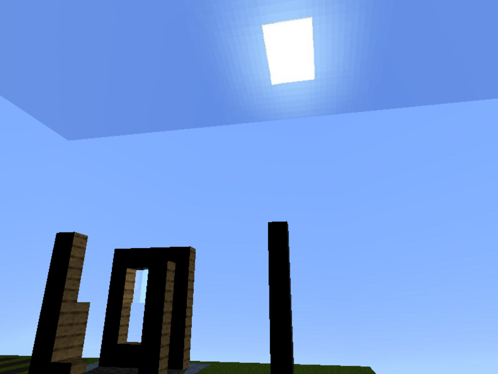
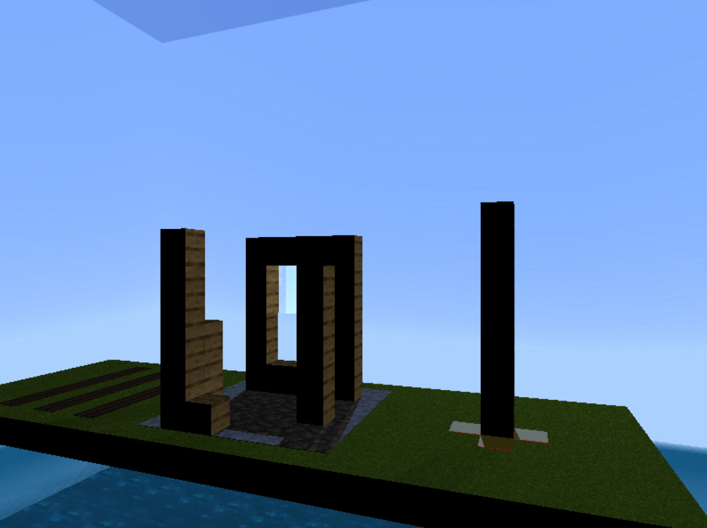

# Proyecto 3 - Raycasting

Este proyecto consite en realizar un diorama 3D basado en el estilo de Minecraft, utilizando la 
técnica de raycasting.

El modelo realizado consiste en una **casa en construcción**. Está compuesta por una ventana 
frontal (únicamente cuenta con la mitad superior del vidrio), columnas de madera y piso pulido de 
piedra. En la parte de afuera de la casa, se cuenta con un totem de piedra y unas franjas de tierra
aradas para cultivos.

## Resultado final

|  |  |
|------------  | -------------  |
|  |  | 
|  |

### Video demostración:

https://github.com/Aq202/proyecto3_graficas_uvg/assets/67699784/70bffe2c-fa51-4fff-b2ce-e83cac3d00d2

